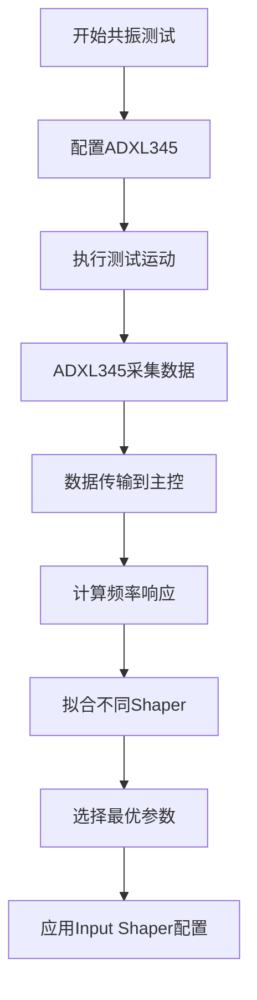
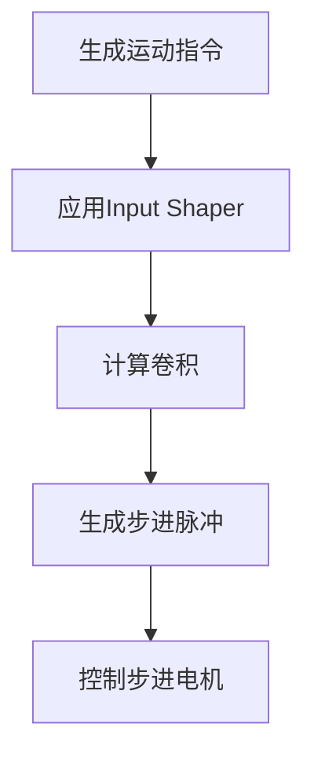

## 1. 概述

共振补偿（Input Shaper）是Klipper中用于减少3D打印机在运动过程中由于机械结构共振引起的振动的技术。通过在运动控制中应用特定的数学算法，可以有效减少打印过程中的振纹，提高打印质量和精度。

本文档将详细介绍：
- Input Shaper 的工作原理
- 实现机制
- 与ADXL345加速度计的集成
- 工作流程
- 代码分析

## 2. 工作原理

### 2.1 振动产生的原因

3D打印机在高速运动时，由于机械结构的弹性特性，会产生共振现象。这种共振会导致打印件表面出现振纹，影响打印质量。

### 2.2 Input Shaper 原理

Input Shaper 是一种前馈控制技术，通过在运动指令中添加特定的时间延迟和幅度调整，使得机械系统的振动相互抵消。其核心思想是：

1. 分析系统的振动特性（频率、阻尼比）
2. 设计特定的脉冲序列来抵消振动
3. 在运动控制中应用这些脉冲序列

### 2.3 支持的 Shaper 类型

Klipper 支持多种 Input Shaper 算法：

- **ZV (Zero Vibration)**: 最简单的 shaper，只有两个脉冲
- **MZV (Multi-step Zero Vibration)**: 三个脉冲，比 ZV 更稳定
- **ZVD (Zero Vibration and Derivative)**: 三个脉冲，对阻尼更不敏感
- **EI (Extraordinarily Insensitive)**: 三个脉冲，对建模误差更不敏感
- **2HUMP_EI**: 四个脉冲，进一步减少振动
- **3HUMP_EI**: 五个脉冲，最优的振动抑制效果

## 3. 核心代码分析

### 3.1 shaper_defs.py - Shaper 定义

```python
# 定义各种 Input Shaper 算法
INPUT_SHAPERS = [
    InputShaperCfg(name='zv', init_func=get_zv_shaper,
                   min_freq=21., max_damping_ratio=0.99),
    InputShaperCfg(name='mzv', init_func=get_mzv_shaper,
                   min_freq=23., max_damping_ratio=0.99),
    # ... 其他 shaper 定义
]
```

每种 shaper 都有一个初始化函数，用于根据频率和阻尼比生成脉冲序列。

### 3.2 input_shaper.py - 主要实现

[input_shaper.py](file:///d%3A/a_project/h_tem3dprinter/klipper/klippy/extras/input_shaper.py) 文件实现了 Input Shaper 的主要功能：

1. 配置解析
2. 与步进电机运动学的集成
3. 运行时参数更新

```python
class InputShaper:
    def __init__(self, config):
        # 初始化 X/Y/Z 三个轴的 shaper
        self.shapers = [AxisInputShaper('x', config),
                        AxisInputShaper('y', config),
                        AxisInputShaper('z', config)]
```

### 3.3 kin_shaper.c - C 语言实现

[kin_shaper.c](file:///d%3A/a_project/h_tem3dprinter/klipper/klippy/chelper/kin_shaper.c) 是 Input Shaper 的核心 C 实现，负责实际的位置计算：

```c
// 通过卷积计算 shaper 后的位置
static inline double
calc_position(struct move *m, int axis, double move_time
              , struct shaper_pulses *sp)
{
    double res = 0.;
    int num_pulses = sp->num_pulses, i;
    for (i = 0; i < num_pulses; ++i) {
        double t = sp->pulses[i].t, a = sp->pulses[i].a;
        res += a * get_axis_position_across_moves(m, axis, move_time + t);
    }
    return res;
}
```

## 4. ADXL345 加速度计集成

### 4.1 ADXL345 工作原理

ADXL345 是一款三轴数字加速度计，能够测量 X/Y/Z 三个方向的加速度。在共振补偿中，它用于：

1. 测量打印机的振动特性
2. 自动校准 Input Shaper 参数

### 4.2 adxl345.py 实现

[adxl345.py](file:///d%3A/a_project/h_tem3dprinter/klipper/klippy/extras/adxl345.py) 实现了与 ADXL345 硬件的通信：

```python
# ADXL345 寄存器定义
REG_DEVID = 0x00
REG_BW_RATE = 0x2C
REG_POWER_CTL = 0x2D
REG_DATA_FORMAT = 0x31
REG_FIFO_CTL = 0x38

# 数据转换
def _convert_samples(self, samples):
    (x_pos, x_scale), (y_pos, y_scale), (z_pos, z_scale) = self.axes_map
    # 将原始数据转换为实际加速度值
    # ...
```

### 4.3 数据采集与处理

1. ADXL345 以高频率（默认3200Hz）采集加速度数据
2. 数据通过 SPI 接口传输到主控板
3. Klipper 对数据进行处理和分析

## 5. 工作流程

### 5.1 自动校准流程



### 5.2 运动控制流程



## 6. 配置与使用

### 6.1 基本配置

在 printer.cfg 中配置 Input Shaper：

```ini
[input_shaper]
shaper_type_x: mzv
shaper_freq_x: 33.2
shaper_type_y: mzv
shaper_freq_y: 39.3
```

### 6.2 ADXL345 配置

```ini
[adxl345]
cs_pin: PB12
spi_bus: spi2
axes_map: x,y,z
```

### 6.3 自动校准命令

```gcode
TEST_RESONANCES AXIS=X
TEST_RESONANCES AXIS=Y
SHAPER_CALIBRATE
```

## 7. 总结

Klipper 的 Input Shaper 功能通过以下方式实现振动补偿：

1. 使用数学算法生成特定的脉冲序列来抵消振动
2. 通过 ADXL345 等加速度计自动测量和校准最优参数
3. 在运动控制中实时应用这些参数以减少振动
4. 提供多种 shaper 算法适应不同的机械结构和需求

这种实现方式不仅提高了打印质量，还具有良好的适应性和扩展性，可以根据不同的打印机特性进行优化调整。